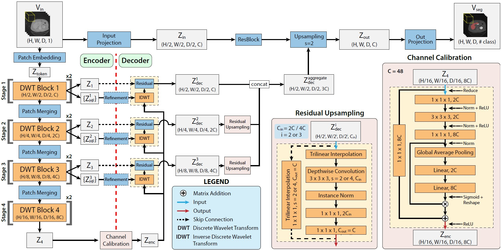
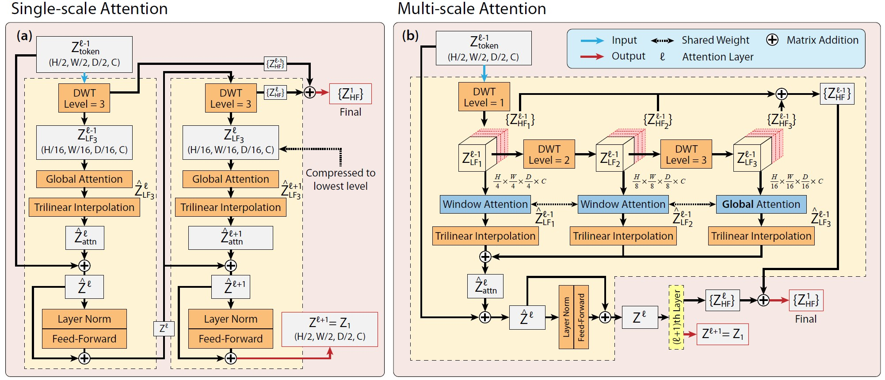
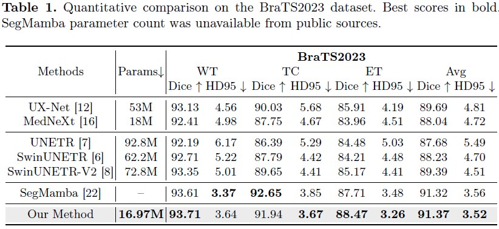
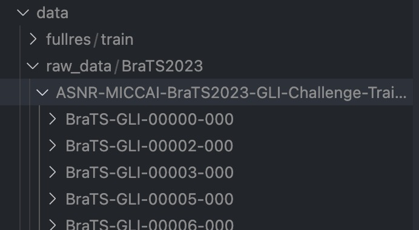

# WaveFormer on BraTS

WaveFormer: A 3D Transformer with Wavelet-Driven Feature Representation for Efficient Medical Image Segmentation

[https://arxiv.org/abs/2503.23764](https://arxiv.org/abs/2503.23764)







## Contact 
If you have any questions about our project, please feel free to contact us by email at mdmahfuzalhasan@ufl.edu.

## Environment install
Clone this repository and navigate to the root directory of the project.

```bash
git clone https://github.com/mahfuzalhasan/WaveFormer.git

```

## Preprocessing, training, testing, inference, and metrics computation

### Data downloading 

Data is from [https://arxiv.org/abs/2305.17033](https://arxiv.org/abs/2305.17033)

Download from Baidu Disk  [https://pan.baidu.com/s/1C0FUHdDtWNaYWLtDDP9TnA?pwd=ty22提取码ty22](https://pan.baidu.com/s/1C0FUHdDtWNaYWLtDDP9TnA?pwd=ty22) 

Download from OneDrive [https://hkustgz-my.sharepoint.com/:f:/g/personal/zxing565_connect_hkust-gz_edu_cn/EqqaINbHRxREuIj0XGicY2EBv8hjwEFKgFOhF_Ub0mvENw?e=yTpE9B](https://hkustgz-my.sharepoint.com/:f:/g/personal/zxing565_connect_hkust-gz_edu_cn/EqqaINbHRxREuIj0XGicY2EBv8hjwEFKgFOhF_Ub0mvENw?e=yTpE9B)

### Preprocessing
In my setting, the data directory of BraTS2023 is : "./data/raw_data/BraTS2023/ASNR-MICCAI-BraTS2023-GLI-Challenge-TrainingData/"

First, we need to run the rename process.

```bash 
python 1_rename_mri_data.py
```

Then, we need to run the pre-processing code to do resample, normalization, and crop processes.

```bash
python 2_preprocessing_mri.py
```

After pre-processing, the data structure will be in this format:


### Training 

When the pre-processing process is done, we can train our model.

We mainly use the pre-processde data from last step: **data_dir = "./data/fullres/train"**


```bash 
python 3_train.py
```

The training logs and checkpoints are saved in:
**logdir = f"./logs/segmamba"**


### Inference 

When we have trained our models, we can inference all the data in testing set.

```bash 
python 4_predict.py
```

When this process is done, the prediction cases will be put in this path:
**save_path = "./prediction_results/segmamba"**

### Metrics computation
We can obtain the Dice score and HD95 on each segmentation target (WT, TC, ET for BraTS2023 dataset) using this code:

```bash
python 5_compute_metrics.py --pred_name="segmamba"
```


## Acknowledgement
Many thanks for these repos for their great contribution!

[https://github.com/MIC-DKFZ/nnUNet](https://github.com/MIC-DKFZ/nnUNet)

[https://github.com/Project-MONAI/MONAI](https://github.com/Project-MONAI/MONAI)

[https://github.com/hustvl/Vim](https://github.com/hustvl/Vim)

[https://github.com/bowang-lab/U-Mamba](https://github.com/bowang-lab/U-Mamba)

